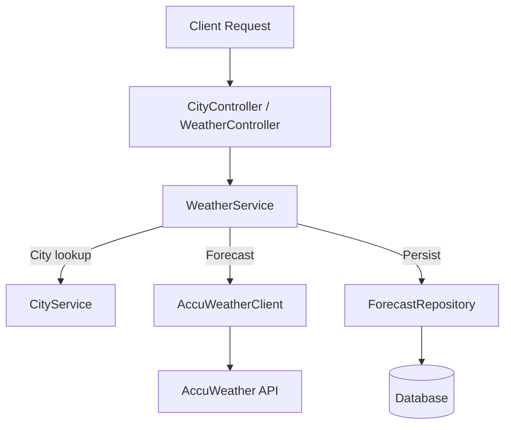

# ⛅ Weather API


A REST API that integrates with **AccuWeather** to fetch **daily forecasts** for cities and **persists** summary data (min/max temperatures) in a relational database.  
Includes **Swagger/OpenAPI** for API documentation and **Spring Boot Actuator** for monitoring and health checks.

---

## 📚 Table of Contents

- [✨ Features](#-features)
- [🧭 Architecture](#-architecture)
- [🛠 Technology Stack](#-technology-stack)
- [⚙️ Installation & Setup](#️-installation--setup)
- [📡 API Usage](#-api-usage)
- [🩺 Monitoring & Health Checks](#-monitoring--health-checks)
- [🐳 Docker Deployment](#-docker-deployment)
- [🚀 Suggested Improvements](#-suggested-improvements)
- [🧾 Why Records & Sealed Classes](#-why-records--sealed-classes)
- [🧾 Credits](#-credits)

---

## ✨ Features

- ✅ **Migrated to Java 21** (modern syntax, LTS, better runtime performance).
- ✅ **Swagger/OpenAPI** for interactive documentation.
- ✅ **Spring Boot Actuator** for health checks and metrics.
- ✅ **Persistence** of forecasts (min/max) into a `forecast` table.
- ✅ **Dockerfile** and **docker-compose** included.

**Current endpoints:**
- `GET /api/city?text={city}` → returns the **Key** and **LocalizedName** of the first match.
- `GET /api/forecast/city/today?city={city}` → returns **today’s forecast** (min/max) and stores it in DB.

---

## 🧭 Architecture


**Key components (explicit):**
- **Controllers** → REST endpoints.
- **WeatherService** → business logic and persistence.
- **AccuWeatherClient** → encapsulates external API calls.
- **ForecastRepository** → saves forecast records in DB.

---

## 🛠 Technology Stack

- ☕ **Java 21 (LTS)**
- 🌱 **Spring Boot 3.x**
- 📖 **springdoc-openapi** (Swagger UI)
- 🗄️ **Spring Data JPA**
- 🐳 **Docker / Docker Compose**
- 🔧 **Maven**

---

## ⚙️ Installation & Setup

### Prerequisites
- **Java 21**
- **Maven 3.9+**
- *(Optional)* **Docker & Docker Compose**

### Environment Variables
You need an AccuWeather API Key:
```bash
export ACCUWEATHER_API_KEY=<your_api_key>
```

### Run Locally
```bash
./mvnw spring-boot:run
```

App will be available at:  
👉 http://localhost:8080

---

## 📡 API Usage

### 1) Search City
```
GET /api/city?text={cityName}
```

**Example:**
```bash
curl -sS "http://localhost:8080/api/city?text=San%20Pablo" -H "Accept: application/json"
```

**Response:**
```json
{
  "Key": "263780",
  "LocalizedName": "San Pablo City"
}
```

---

### 2) Get Today’s Forecast
```
GET /api/forecast/city/today?city={cityName}
```

**Example:**
```bash
curl -sS "http://localhost:8080/api/forecast/city/today?city=San%20Pablo"   -H "Accept: application/json"
```

**Response:**
```json
{
  "Date": "2023-03-17T07:00:00+08:00",
  "Temperature": {
    "Minimum": { "Value": 73, "Unit": "F", "UnitType": 18 },
    "Maximum": { "Value": 89, "Unit": "F", "UnitType": 18 }
  }
}
```

---

### Swagger UI

- **Docs** → http://localhost:8080/swagger-ui.html
- **OpenAPI JSON** → http://localhost:8080/v3/api-docs

---

## 🩺 Monitoring & Health Checks

- `GET /actuator/health` → application status (**UP/DOWN**)
- `GET /actuator/info` → app metadata

---

## 🐳 Docker Deployment

Build and run via docker-compose:
```bash
docker compose up --build
```

---

## 🚀 Suggested Improvements

### API & REST Design
- Add **versioning**: `/api/v1/...`
- Use standardized params (**`q`** instead of `text`)
- Improve error handling with **ProblemDetail**:
    - **400** → invalid params
    - **404** → city not found
    - **502** → upstream failure

### Testing & Coverage
- Unit tests for **services**, **controllers**, **repositories**
- Integration tests for **endpoints**
- Coverage with **JaCoCo**

### Observability
- Expose **`/metrics`**
- Configure **`logback-spring.xml`**
- Add Spring **profiles** (`dev`, `test`, `prod`)

### Security & Robustness
- Add **Bean Validation** on request params
- **Timeouts & Circuit Breaker** for external API calls

### Clean Code & Java 21
- Use **records** for DTOs
- Use **sealed classes** for controlled hierarchies
- Use modern Java syntax (**switch**, **pattern matching**)

---

## 🧾 Why Records & Sealed Classes?

- **Records**: concise, immutable data carriers (perfect for DTOs).  
  They reduce boilerplate and make your models transparent and safer.

- **Sealed classes**: enforce a **closed inheritance hierarchy**, making the domain model clearer and preventing unintended subclassing.  
  Useful for modeling fixed sets of forecast types or error categories.

Together, they make the codebase **safer, cleaner, and more expressive**, leveraging the full power of **Java 21**.

---

## 🧾 Credits

- Repository: **vivianagh/weather-api**
- Branch: **feacture/java21-swagger-actuator**